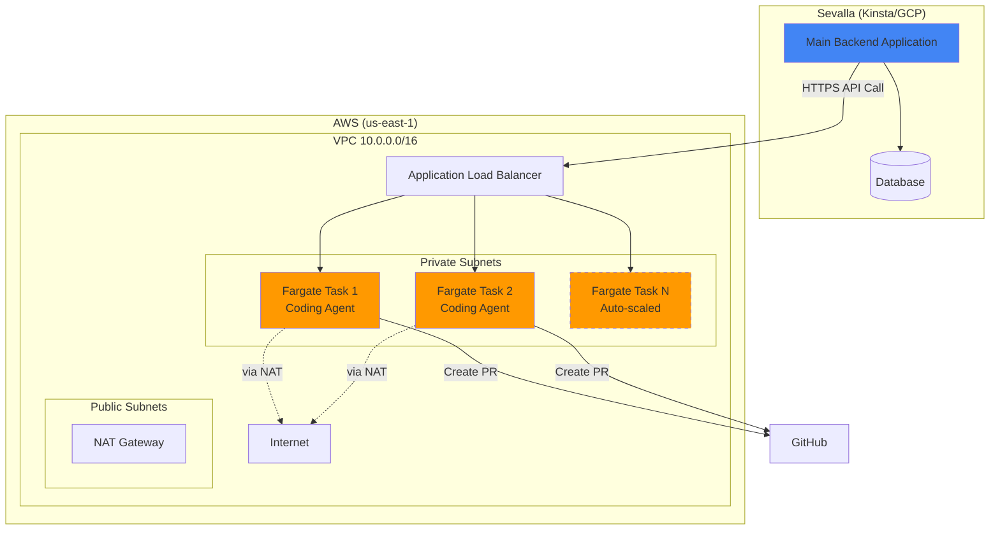

# Fargate + Sevalla Architecture

## 🎯 Your Final Architecture



## ✅ Why This Setup?

### Separation of Concerns:

| Component | Platform | Purpose | Why |
|-----------|----------|---------|-----|
| **Main Backend** | Sevalla (GCP) | User-facing API, business logic | Simple deployment, auto-scale from Git |
| **Coding Agent** | AWS Fargate | Execute code fixes | Production isolation, VPC security |

### Benefits:

1. **Security**: Fargate runs in isolated VPC with controlled egress
2. **Scalability**: Each service scales independently
3. **Cost Control**: Right-size each service separately
4. **Simplicity**: Sevalla for easy stuff, Fargate for complex/risky stuff
5. **Compliance**: AWS Fargate meets enterprise security requirements

## 📁 Project Structure

```
coding-agent/
├── backend.py                    # FastAPI service (runs on Fargate)
├── fix_issue.py                  # Core issue fixing logic
├── Dockerfile                    # Container definition
├── terraform/
│   └── main.tf                   # Complete AWS infrastructure
├── AWS_FARGATE_DEPLOYMENT.md     # Deployment guide
├── SEVALLA_DEPLOYMENT.md         # Sevalla setup (for main backend)
└── integration_example.py        # How Sevalla calls Fargate
```

## 🚀 Quick Start

### 1. Deploy Coding Agent to AWS Fargate

```bash
# Set up AWS infrastructure
cd terraform
terraform init
terraform apply

# Get the ALB endpoint
terraform output alb_dns_name
# Example: coding-agent-alb-xyz.us-east-1.elb.amazonaws.com
```

### 2. Configure Sevalla Backend

In your Kinsta/Sevalla dashboard:
1. Go to your application → Settings → Environment variables
2. Add:
   ```
   CODING_AGENT_URL=http://coding-agent-alb-xyz.us-east-1.elb.amazonaws.com
   CODING_AGENT_API_KEY=your-secret-api-key
   ```

### 3. Call from Sevalla

```python
# In your Sevalla backend code
import os
import requests

def trigger_issue_fix(issue_url: str):
    response = requests.post(
        f"{os.getenv('CODING_AGENT_URL')}/fix-issue",
        headers={"X-API-Key": os.getenv("CODING_AGENT_API_KEY")},
        json={"issue_url": issue_url}
    )
    return response.json()
```

## 💰 Cost Breakdown

### AWS Fargate (Coding Agent):
- 2 tasks × 2 vCPU × 4 GB RAM
- **~$200-300/month**

### Sevalla (Main Backend):
- Usage-based pricing
- **~$30-100/month**

### Total: ~$250-400/month

Much cheaper than running everything on AWS, better isolated than running everything on Sevalla!

## 🔒 Security

### AWS Fargate:
- ✅ Private VPC subnets
- ✅ Security groups
- ✅ NAT Gateway for controlled egress
- ✅ Secrets Manager for API keys
- ✅ IAM roles and policies
- ✅ CloudWatch logging

### Communication:
- ✅ API key authentication between services
- ✅ HTTPS (add ACM certificate for production)
- ✅ Rate limiting
- ✅ Request logging

## 📊 Monitoring

### AWS CloudWatch:
- ECS task metrics (CPU, memory)
- ALB metrics (requests, errors)
- Custom application logs
- Alarms for failures

### Sevalla Dashboard:
- Application metrics
- Request logs
- Build status

## 🎯 Next Steps

1. **Deploy**: Follow [AWS_FARGATE_DEPLOYMENT.md](./AWS_FARGATE_DEPLOYMENT.md)
2. **Integrate**: Use code from [integration_example.py](./integration_example.py)
3. **Secure**: Add API authentication
4. **Monitor**: Set up CloudWatch alarms
5. **Scale**: Adjust auto-scaling policies

---

**You have a production-ready, secure, and scalable architecture!** 🎉
