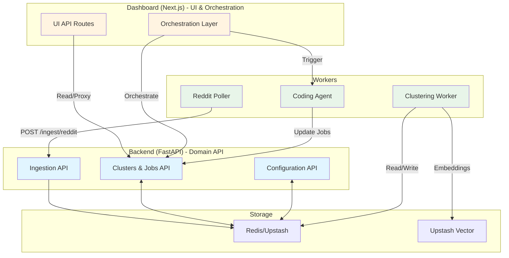
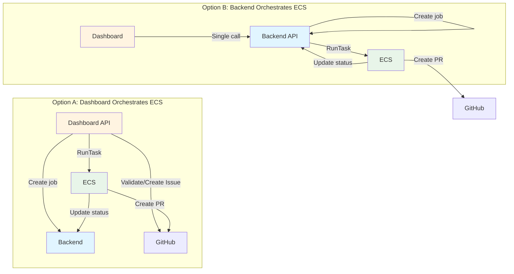
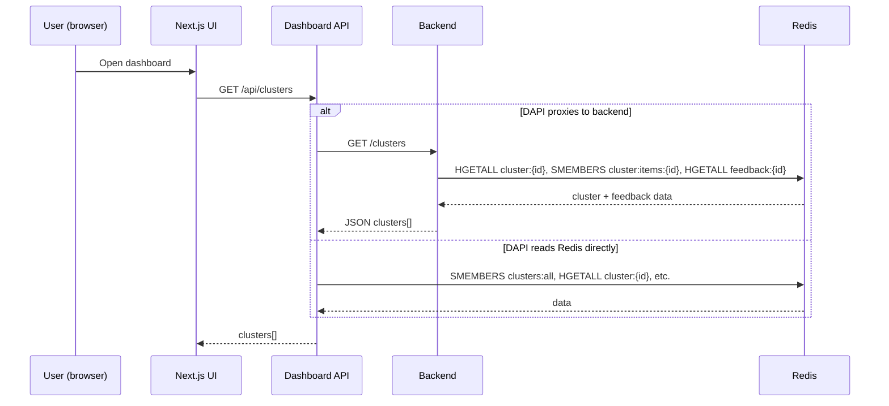
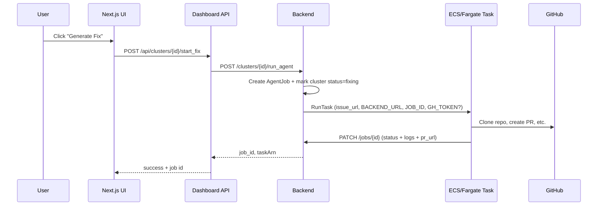

# API & Workers Architecture Plan

This document focuses on the second major concern: clarifying how APIs (backend vs dashboard) and workers (poller, clustering, coding agent) should be structured so that:

- There are fewer hops for common flows.
- Each component has a clear responsibility.
- Clustering and “Generate Fix” work reliably end‑to‑end.

It builds on `documentation/current_architecture.md` and the ingestion plan in `documentation/ingestion_polling_architecture_plan.md`.

---

## 1. Mental Model (Target)

Think in terms of three layers:

1. **Backend API (FastAPI)** – source of truth for domain operations:
   - Ingestion of feedback (`/ingest/*`).
   - Cluster/job lifecycle (`/clusters`, `/clusters/{id}`, `/jobs`, `/jobs/{id}`).
   - Configuration (`/config/reddit/subreddits`, etc.).

2. **Dashboard API (Next.js)** – presentation and orchestration for the UI:
   - Thin, UI-oriented routes that call backend and/or read from Redis.
   - Does not define its own competing domain model; instead, it projects backend/Redis data into UI-friendly shapes.

3. **Workers** – long-running or background tasks:
   - **Reddit poller**: produces feedback via backend ingestion.
   - **Clustering worker**: consumes `feedback:unclustered` and maintains clusters.
   - **Coding agent (Fargate)**: consumes jobs created by backend and writes back job + cluster status.

From the user’s perspective:

> “The dashboard always talks to **one API surface**, and workers talk to the same backend/Redis; I don’t have to care whether code is Python or TypeScript under the hood.”

---

## 2. Current State (Pain Points)

Today, as summarized in `documentation/current_architecture.md`:

- **API duplication**
  - Backend exposes `/feedback`, `/clusters`, `/stats` over FastAPI.
  - Dashboard exposes `/api/feedback`, `/api/clusters`, `/api/stats` that read the same Redis keys directly.
  - Some flows use backend; others go straight through dashboard APIs and bypass backend entirely.

- **Multi-hop “Generate Fix”**
  - UI → `/api/clusters/[id]/start_fix` (Next.js):
    - Hits backend `GET /clusters/{id}`.
    - Calls `/api/trigger-agent` (Next.js) to start the Fargate coding agent.
    - Calls backend `POST /clusters/{id}/start_fix` to mark status.
  - `/api/trigger-agent` then:
    - Optionally creates a GitHub issue (Octokit).
    - Calls backend `POST /jobs` to create a job record.
    - Starts the ECS task (`RunTaskCommand`) with env overrides.

- **Split clustering responsibility**
  - Backend has `_auto_cluster_feedback` (source/subreddit buckets).
  - Dashboard has vector clustering (`/api/clusters/run-vector`) and generates cluster summaries.
  - Both write to the same `cluster:{id}`, `cluster:items:{id}`, and `clusters:all` keys, but with different logic.

This makes it hard to answer simple questions like:
- “Which API am I supposed to use to list clusters?”
- “Where does a cluster’s summary actually come from?”
- “Who is responsible for starting and tracking an agent job?”

---

## 3. Target API & Worker Responsibilities

### 3.1 Backend (FastAPI) – Domain API

Backend should own:

- **Ingestion API**
  - `/ingest/reddit`, `/ingest/sentry`, `/ingest/manual`, `/ingest/github?`
  - Writes `FeedbackItem`s and marks them as unclustered (see ingestion plan).

- **Clusters & Jobs API**
  - `GET /clusters`, `GET /clusters/{id}`:
    - Read from Redis `cluster:{id}`, `cluster:items:{id}` and hydrate `FeedbackItem`s.
    - Do **not** implement their own clustering algorithm once vector clusters are canonical; treat clusters as data managed by the clustering worker.
  - `POST /clusters/{id}/start_fix`:
    - Create a job (`AgentJob`) for that cluster.
    - Mark cluster status as `"fixing"`.
    - Optionally orchestrate the agent worker directly (see §3.3).
  - `GET /jobs`, `GET /jobs/{id}`, `GET /clusters/{id}/jobs`:
    - Provide job inspection/monitoring.
  - `PATCH /jobs/{id}`:
    - Allow coding agent to report progress + logs, PR URL, etc.

- **Configuration API**
  - `GET/POST /config/reddit/subreddits` – global Reddit config, backed by Redis.
  - (Optionally) additional configuration endpoints for clustering thresholds, repos, etc.

Backend **should not** need to know about AWS ECS or GitHub directly once orchestration moves to a dedicated worker or remains in the dashboard.

### 3.2 Dashboard (Next.js) – UI & Orchestration

Dashboard should:

- **Read data via a single abstraction**:
  - Either:
    - Continue using `dashboard/lib/redis.ts` as a read-only data access layer, or
    - Switch to calling backend’s `/clusters`, `/feedback`, `/stats` endpoints and thinly projecting them into UI types.
  - The key is to avoid duplicating business rules (cluster assembly, stats computation) in both Python and TypeScript.

- **Expose a small set of UI-focused API routes:**
  - `GET /api/clusters`:
    - Either proxy to backend `/clusters` or continue to read Redis directly, but clearly declare it as “UI API”, not a second domain API.
  - `GET /api/feedback`, `/api/stats`:
    - Same idea; either proxy to backend or read Redis directly.
  - `POST /api/clusters/[id]/start_fix`:
    - Purely orchestrational:
      - Fetch cluster from backend (or via Redis) to show to the user.
      - Ask backend to start a fix (`POST /clusters/{id}/start_fix`) which creates a job.
      - Optionally call a **single** worker-facing API (`/api/trigger-agent` or backend equivalent) to actually start the ECS task.

- **Keep clustering logic isolated:**
  - `POST /api/clusters/run-vector` should be treated as a **worker endpoint** exposed through Next.js, not as a general-purpose API.
  - It does not need to be called from the browser; instead, it can be:
    - Triggered manually via admin UI.
    - Triggered on a schedule (cron job hitting the URL).

### 3.3 Coding Agent & ECS – Worker

The coding agent stack consists of:

- ECS task running `coding-agent/fix_issue.py`.
- GitHub operations via `gh` CLI + Kilo.
- Backend job updates via `/jobs/{id}`.

We have two plausible architectures:

#### Option A – Dashboard orchestrates ECS (current)

- `/api/trigger-agent` (Next.js) is responsible for:
  - Validating or creating a GitHub issue.
  - Creating a backend job (`POST /jobs`).
  - Starting the ECS task with `BACKEND_URL`, `JOB_ID`, `GH_TOKEN` in env.
- Backend remains unaware of AWS/ECS and just exposes `/jobs` API.

**Pros:**
- Keeps AWS SDK and GitHub logic in Node/TS (matching Vercel deployment).
- Less Python surface area.

**Cons:**
- “Generate Fix” path crosses boundaries: dashboard → backend → dashboard → ECS → backend.

#### Option B – Backend orchestrates ECS (proposed simplification)

- Introduce a backend endpoint, e.g. `POST /clusters/{id}/run_agent`, that:
  - Validates cluster and creates an `AgentJob`.
  - Calls ECS via Python SDK (`boto3`) or a small internal service.
  - Returns job ID and task ARN.
- Dashboard’s `/api/clusters/[id]/start_fix` becomes a thin proxy to this backend route.
- `/api/trigger-agent` can be retired or restricted to internal CLI use.

**Pros:**
- End-to-end “Generate Fix” path becomes:
  - UI → dashboard → **single backend call** → ECS.
- Backend owns job lifecycle and ECS integration, matching its role as domain API.

**Cons:**
- More Python/Gunicorn/uvicorn responsibilities (AWS SDK, secrets).
- Slightly more work to re-implement the Octokit-based “create issue” helper in Python, or to keep that part in the dashboard and pass a pre-created `issue_url` into backend.

**Recommended path:** Start with Option A (as-is) but gradually move toward Option B once ingestion/clustering are stable. This keeps the number of major refactors manageable.

---

## 4. End-to-End Flows (Target)

### 4.1 “View Clusters” Flow

**Target behavior:**

Key property: there is **one logical API** for clusters; whether it’s backed by Redis directly or by backend is an implementation detail, not a separate domain contract.

### 4.2 “Generate Fix” Flow (Medium-Term Target)

With backend orchestrating ECS (Option B):

The dashboard polls backend `/jobs/{id}` or `/clusters/{id}/jobs` to show progress.

If you stay on Option A longer term, the flow is similar but keeps `/api/trigger-agent` in the middle; the key simplification is to make sure the dashboard always calls **one** “start agent” endpoint per cluster, rather than bouncing between multiple services.

---

## 5. Phased Refactor Plan

### Phase 1 – Clarify read/write responsibilities (low risk)

1. **Mark dashboard Redis helpers as read-only except clustering.**
   - Add comments to `dashboard/lib/redis.ts`:
     - Reads: `getClusters`, `getClusterDetail`, `getFeedback`, `getStats`, `getRedditSubreddits`.
     - Writes: temporarily allowed only for clustering (`feedback:unclustered` handling) until ingestion is routed through backend.
   - Avoid adding new direct-write helpers here.

2. **Document that backend `/clusters` and `/clusters/{id}` are projections of Redis.**
   - Eventually, align their behavior with how dashboard reads clusters so both surfaces show the same data.

3. **Keep `/api/clusters/run-vector` as a worker endpoint.**
   - Do not call it from client-side code.
   - Optionally protect it with a simple admin secret or IP allowlist.

### Phase 2 – Align cluster data model across backend and dashboard

1. **Treat Redis as the single source of truth for clusters.**
   - Ensure both backend and dashboard:
     - Read `cluster:{id}` hashes and `cluster:items:{id}` sets.
     - Do not maintain independent in-memory cluster stores (beyond caching).

2. **Update backend cluster endpoints to read Redis shapes directly.**
   - When legacy `_auto_cluster_feedback` is turned off (see ingestion plan), backend should:
     - Stop creating clusters on its own.
     - Only read clusters created by the vector worker.

3. **Ensure vector worker writes enough fields for both layers.**
   - `cluster:{id}` payload should include at least:
     - `id`, `title`, `summary`, `status`, `created_at`, `updated_at`, `github_repo_url?`, `issue_title?`, `issue_description?`.
   - This matches both backend `IssueCluster` and dashboard `IssueCluster` types.

### Phase 3 – Simplify “Generate Fix” orchestration

1. **Define a single “start agent” backend endpoint.**
   - Option A: Keep `/api/trigger-agent` but make backend expose `POST /clusters/{id}/start_fix` that:
     - Creates job + marks cluster status.
     - Calls `/api/trigger-agent` server-to-server with `issue_url` + `cluster_id`.
   - Option B (preferred longer term): implement `POST /clusters/{id}/run_agent` in backend that:
     - Creates job + marks status.
     - Starts ECS task via Python AWS SDK.

2. **Thin down Next.js route for `start_fix`.**
   - `POST /api/clusters/[id]/start_fix` should:
     - Do minimal validation/lookup for UI needs.
     - Delegate to the backend endpoint chosen above.

3. **Centralize job viewing in backend.**
   - UI should call backend `/jobs` API (via dashboard route or directly) to show job history and details, rather than mixing job data from multiple sources.

### Phase 4 – Optional: Make dashboard a pure client of backend

Once ingestion and clustering are stable and you’re comfortable with backend scaling:

1. **Replace direct Redis reads with backend calls for most UI data.**
   - Example: `getClusters()` in `dashboard/lib/redis.ts` becomes `getClusters()` in `dashboard/lib/backend.ts` that calls `GET {BACKEND_URL}/clusters`.
   - Redis remains the backend’s concern; the dashboard only talks HTTP.

2. **Keep Redis/vector as implementation details behind backend.**
   - Clustering worker can still be Next.js or a separate Node service, but it writes to Redis that backend reads.
   - The dashboard remains agnostic: it only knows about backend APIs.

---

## 6. What This Gives You

If you follow these plans (ingestion + API/workers) you end up with:

- **One ingestion surface** (backend) and **one clustering pipeline** (vector-based).
- A dashboard that mostly acts as a client, not a second backend.
- Workers (poller, clustering, coding agent) that all talk to the same backend/Redis contracts.
- Clear, debuggable flows for:
  - “Where did this piece of feedback come from?”
  - “Why is this cluster grouped this way?”
  - “What is the status of the fix job for this cluster?”

You can implement these phases incrementally and validate each step with small tests and manual flows, without needing a big-bang rewrite.

