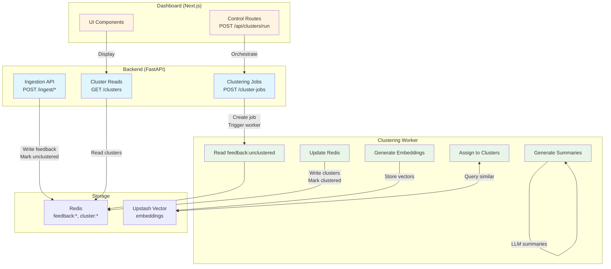
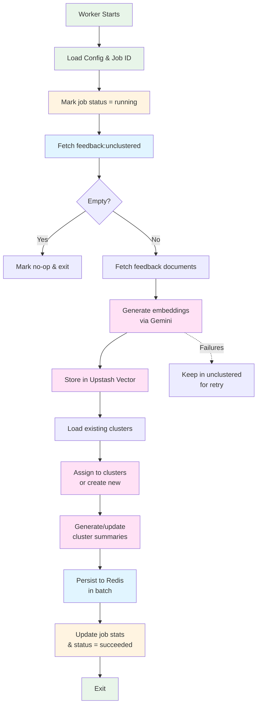
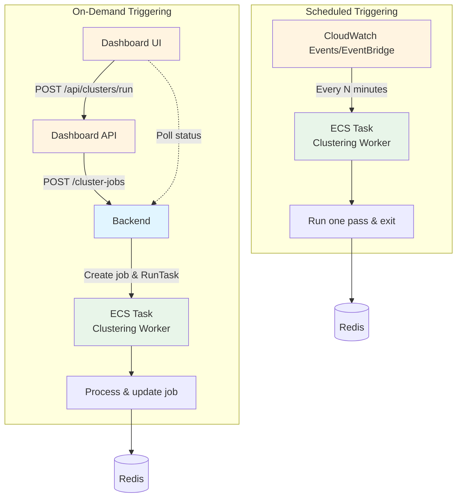

# Clustering Worker Architecture Plan

This document focuses on a single question:

> How do we move clustering off Vercel’s `/dashboard/app/api` and into a proper worker, while keeping the current Redis/Upstash data model and avoiding a second “backend” inside Next.js?

It builds on:

- `documentation/current_architecture.md` – snapshot of how things work today.
- `documentation/ingestion_polling_architecture_plan.md` – ingestion & Reddit poller.
- `documentation/api_workers_architecture_plan.md` – overall API + workers shaping.

The goal here is to make clustering **worker‑driven**, not **request‑driven**, so that:

- Heavy work (embeddings, vector search, centroid updates, summaries) does **not** run inside Vercel functions.
- The dashboard becomes a thin **control plane** for clustering, not the execution engine.
- Backend + workers own the **canonical clustering pipeline**, with Redis/Upstash as the shared state.

---

## 1. Problem & Goals

### 1.1 Today’s pain points

From `documentation/current_architecture.md` and the current code:

- Clustering runs inside Next.js API routes:
  - `/app/api/clusters/run` – centroid‑based clustering using `dashboard/lib/clustering.ts`.
  - `/app/api/clusters/run-vector` – Upstash Vector + Gemini‑based clustering using `dashboard/lib/vector.ts`.
- Those routes:
  - Execute all embedding and clustering logic inside a Vercel runtime.
  - Hold open HTTP requests while doing work, which is fragile under time limits and concurrency.
  - Tie clustering cadence to manual UI/API calls.
- Backend (FastAPI) still has legacy `_auto_cluster_feedback`, so there are **two competing clustering stories**:
  - Naive backend clusters created on ingest.
  - Vector clusters created via dashboard APIs.

### 1.2 What we want instead

High‑level objectives:

- **Move heavy work off Vercel**:
  - No more long‑running clustering jobs inside `/app/api/*`.
  - Vercel functions become control endpoints only (enqueue, inspect status).
- **Single canonical clustering pipeline**:
  - All sources (Reddit, Sentry, manual, GitHub) write feedback and mark it `feedback:unclustered`.
  - A dedicated **clustering worker** consumes `feedback:unclustered` and writes `cluster:*` and `cluster:items:*`.
- **Clear responsibilities**:
  - Backend: ingestion, cluster/job APIs, configuration.
  - Dashboard: UI and light orchestration.
  - Workers: ingestion poller, clustering worker, coding agent.
- **Batch / async semantics**:
  - Clustering runs as a batch job (or small batches), either on a schedule or on demand.
  - UI asks “run clustering” and receives a **job id**, not a synchronous result.

---

## 2. Target Responsibility Split

This section zooms in on clustering only, refining the three‑layer mental model from `api_workers_architecture_plan.md`.

### 2.1 Backend (FastAPI)

Backend should own the **domain API** around clusters and clustering jobs:

- **Ingestion (unchanged from ingestion plan)**:
  - `POST /ingest/*` (Reddit, Sentry, manual, GitHub, etc.).
  - On new feedback:
    - Writes `feedback:{uuid}`, `feedback:created`, `feedback:source:{source}`, `feedback:external:{source}:{external_id}`.
    - Adds the id to `feedback:unclustered`.
  - No vector/LLM work here.

- **Cluster reads**:
  - `GET /clusters`, `GET /clusters/{id}`:
    - Read `cluster:{id}` + `cluster:items:{id}` from Redis.
    - Hydrate `FeedbackItem`s for the dashboard.
    - Treat clusters as **data produced by the clustering worker**, not something backend computes.

- **Clustering jobs (new)**:
  - `POST /cluster-jobs` (or `POST /clusters/run`):
    - Creates a `ClusterJob` record in Redis, e.g.:
      - `cluster_job:{uuid}` with fields:
        - `id`, `status` (`pending` | `running` | `succeeded` | `failed`),
        - `created_at`, `started_at?`, `finished_at?`,
        - `stats` (clustered count, new/updated clusters, failed embeddings),
        - `error?` (string).
      - `cluster_jobs:recent` sorted set (score = timestamp).
    - Triggers the clustering worker (see §3) by:
      - Calling AWS ECS `RunTask` (mirroring the coding agent path), or
      - Publishing to a queue/cron mechanism.
    - Returns `job_id` to the caller.
  - `GET /cluster-jobs`, `GET /cluster-jobs/{id}`:
    - Allow UI to monitor clustering progress and inspect last run statistics.

Backend does **not** call Gemini or Upstash Vector directly unless we explicitly choose to implement the worker in Python. In the near term it’s enough that backend owns:

- The **job model**.
- The **cluster & feedback read API**.
- The **contract** the worker must honor in Redis.

### 2.2 Dashboard (Next.js)

Dashboard should act as a **client of backend + worker**, not a second backend:

- **Reads**:
  - Prefer calling backend HTTP APIs:
    - `GET {BACKEND_URL}/clusters` → rendered in UI.
    - `GET {BACKEND_URL}/cluster-jobs` → show last run / status.
  - Direct Redis reads are acceptable short‑term, but should be treated as an implementation detail that mirrors backend behavior.

- **Writes / orchestration**:
  - `POST /app/api/clusters/run` (and/or `/run-vector`) should be converted to a **thin control route**:
    - Validate auth / admin.
    - Call backend `POST /cluster-jobs`.
    - Return `{ job_id }` (and maybe the initial job payload).
  - No embeddings, clustering, or summarization logic remains inside these routes.

Over time, most clustering‑related types and logic in `dashboard/lib/clustering.ts` should move to a reusable library used by the worker, leaving the dashboard with only:

- DTOs / mapping to UI models.
- Small helpers for calling backend and rendering progress.

### 2.3 Clustering Worker (new)

The clustering worker is a **containerized, batch‑oriented process** whose only job is to:

1. Read `feedback:unclustered` and the current `cluster:*` state.
2. Generate embeddings for new feedback.
3. Assign feedback to existing clusters or create new clusters.
4. Generate/update cluster summaries.
5. Persist changes to Redis (`cluster:*`, `cluster:items:*`, `clusters:all`, `feedback:{id}.clustered`).
6. Update the `ClusterJob` record with progress and final stats.

Recommended runtime (to minimize rework):

- **Language**: Node.js/TypeScript, reusing:
  - `dashboard/lib/clustering.ts` for centroid logic + summarization.
  - `dashboard/lib/vector.ts` for Upstash Vector + embeddings.
- **Deployment**:
  - Build a small worker image (analogous to the coding agent image) that:
    - Boots a single `runClusteringOnce()` function.
    - Exits with success/failure.
  - Run it on **AWS ECS Fargate**, scheduled or on demand.

Alternative (if we want everything in Python): re‑implement the clustering logic in `backend/` and run the worker as a Python container. That trades more porting work for a single language on the backend/worker side.

---

## 3. Worker Design

### 3.1 Environment & configuration

The worker container receives configuration via env vars:

- Redis/Upstash:
  - `UPSTASH_REDIS_REST_URL`, `UPSTASH_REDIS_REST_TOKEN` (or `REDIS_URL`).
- Vector & embeddings:
  - `UPSTASH_VECTOR_URL` / equivalent.
  - `GEMINI_API_KEY` (or `GOOGLE_GENERATIVE_AI_API_KEY`).
- Backend integration:
  - `BACKEND_URL` (optional, if the worker wants to talk to FastAPI for any reason).
  - `CLUSTER_JOB_ID` (string) – the job id created by backend.

On start, the worker:

1. Loads configuration.
2. Marks `cluster_job:{id}.status = "running"` and `started_at` (if `CLUSTER_JOB_ID` is set).
3. Executes a single clustering run (see §3.2).
4. Writes final stats + `status = "succeeded" | "failed"` and `finished_at`.
5. Exits.

### 3.2 Clustering algorithm (reuse existing logic)

The worker's algorithm should be a direct extraction of what currently lives in `/app/api/clusters/run` and `/run-vector`:

1. **Fetch unclustered IDs**:
   - Read `feedback:unclustered` (set) from Redis.
   - If empty:
     - Optionally mark job as “no‑op” and exit quickly.
2. **Fetch feedback documents**:
   - For each id in `feedback:unclustered`, load `feedback:{id}`.
   - Track:
     - `validFeedback` – items that exist and can be processed.
     - `missingFeedbackIds` – ids present in `feedback:unclustered` but missing in Redis.
3. **Generate embeddings**:
   - For each `FeedbackItem` in `validFeedback`:
     - Build text with `prepareTextForEmbedding` (existing helper).
     - Call Gemini embeddings (batched).
     - Store embeddings in Upstash Vector (reusing `VectorStore` helper).
   - Keep track of any failures; those ids remain in `feedback:unclustered` for retry.
4. **Assign to clusters**:
   - Load current clusters from Redis (`cluster:{id}`, `cluster:items:{id}`).
   - Use `ClusteringBatch.assignToClusters` (or `clusterWithVectorDB`) to:
     - Either:
       - Query Upstash Vector for similar items and map them to clusters, **or**
       - Use centroid‑based similarity (`cosineSimilarity`) against existing centroids.
     - Create new clusters when similarity < threshold.
5. **Generate/update summaries**:
   - For clusters that changed:
     - Fetch all their `FeedbackItem`s (using the worker’s cache).
     - Call `generateClusterSummary` to build:
       - Human‑readable `title`, `summary`.
       - Suggested `issueTitle`, `issueDescription`.
       - Optional repo hints (`github_repo_url`).
6. **Persist changes in batch**:
   - Use a Redis pipeline to:
     - Upsert `cluster:{id}` hashes with summary + centroid.
     - Reset `cluster:items:{id}` sets and add member ids.
     - Mark `feedback:{id}.clustered = true`.
     - Remove successfully processed ids (including missing documents) from `feedback:unclustered`.
   - This is effectively the `executeBatchedRedisOperations` logic moved out of the route.
7. **Update job stats**:
   - In `cluster_job:{id}` (if present), store:
     - `clustered_count`, `new_clusters`, `updated_clusters`,
     - `failed_embeddings`, `missing_feedback`, `duration_ms`.

With this design, the worker is **idempotent-ish**:

- If it dies mid‑run, unprocessed ids remain in `feedback:unclustered`.
- A subsequent run will simply re‑cluster what’s left (and possibly re‑touch some clusters).

### 3.3 Triggering strategy

There are two complementary triggering modes:

1. **Scheduled**:
   - Use CloudWatch Events / EventBridge to trigger the worker ECS task every N minutes.
   - The worker runs one pass and exits.
   - Useful to guarantee “eventual clustering” even if nobody presses buttons in the UI.

2. **On‑demand (via backend/dashboard)**:
   - UI calls `POST /app/api/clusters/run` (Next.js).
   - Next.js calls backend `POST /cluster-jobs`.
   - Backend creates a job, triggers ECS `RunTask` with `CLUSTER_JOB_ID`, and returns `job_id`.
   - UI polls `GET /cluster-jobs/{id}` to show progress and results.

We can start with **on‑demand only** (simpler to wire during development), then add scheduled runs once the worker is stable.

---

## 4. API Changes & Alignment

This section summarizes how APIs change so that backend, dashboard, and worker stay aligned.

### 4.1 Backend API

- New:
  - `POST /cluster-jobs`
    - Body: `{}` (for “cluster everything”) or optionally filters (e.g. `source`, `since`).
    - Response: `ClusterJob` JSON `{ id, status, created_at, ... }`.
  - `GET /cluster-jobs`
    - Returns recent jobs (paged).
  - `GET /cluster-jobs/{id}`
    - Returns a single job with stats.
- Unchanged (semantically):
  - `GET /clusters`, `GET /clusters/{id}`:
    - Continue to read from Redis and act as the single cluster API for the dashboard.
- Deprecated:
  - `_auto_cluster_feedback` and any backend‑side clustering logic that doesn’t go through the worker.
    - Guard behind an env flag and plan to remove once the worker is canonical.

### 4.2 Dashboard API

- `POST /app/api/clusters/run`:
  - Becomes a thin wrapper:
    - Validates caller (admin only).
    - Calls backend `POST /cluster-jobs`.
    - Returns the job payload.
  - **Does not** open Redis directly or run embeddings.
- `POST /app/api/clusters/run-vector`:
  - Can be:
    - Kept as a local‑only debugging endpoint, or
    - Removed after the worker migrates all logic.
  - In either case it should not be on the critical path in production.

UI components should:

- Use `GET /clusters` to show cluster lists as today.
- Use `GET /cluster-jobs` / `{id}` to show:
  - “Last run succeeded at 12:34, clustered 128 items.”
  - “Run clustering” button that starts a new job.

---

## 5. Migration Plan (Incremental)

This plan assumes we want to avoid a big‑bang rewrite and keep the system usable throughout.

### Phase 1 – Make ingestion worker‑friendly

- Ensure **all** ingestion paths populate `feedback:unclustered` (see ingestion plan):
  - Backend ingestion (`add_feedback_item`) adds ids to `feedback:unclustered`.
  - Dashboard‑side ingestion helpers (manual feedback) either:
    - Call backend ingestion endpoints, or
    - Mirror the same Redis writes including `feedback:unclustered`.
- Add a toggle to safely turn off `_auto_cluster_feedback` once vector clustering is stable.

### Phase 2 – Extract clustering logic into a reusable module

- Refactor `dashboard/lib/clustering.ts` and `dashboard/lib/vector.ts` to:
  - Separate **pure logic** (embedding, similarity, centroid math, summary generation) from **Next.js runtime concerns** (route handlers, `NextResponse`).
  - Provide a `runClusteringBatchOnce()` helper that:
    - Accepts a Redis client, vector client, and logger.
    - Implements the algorithm described in §3.2.
- This helper should be callable from:
  - Current `POST /app/api/clusters/run` routes (temporary).
  - The new worker entrypoint script.

### Phase 3 – Build and wire the worker

- Create a `clustering-worker` package (e.g. `workers/clustering-worker/`):
  - Entry script imports the shared `runClusteringBatchOnce()` helper.
  - Reads env vars, updates `ClusterJob` if `CLUSTER_JOB_ID` is set.
  - Exits with non‑zero code on errors.
- Build a container image and deploy to ECS Fargate (similar to `coding-agent`):
  - Task definition with env overrides from Secrets Manager / ECS task overrides.
  - IAM role limited to Redis/Upstash, vector service, and CloudWatch Logs.
- Add a backend endpoint or internal function that:
  - On `POST /cluster-jobs`, calls ECS `RunTask` with `CLUSTER_JOB_ID`.

### Phase 4 – Thin out dashboard clustering routes

- Update `/app/api/clusters/run` to:
  - Call backend `POST /cluster-jobs`.
  - Stop calling the pure clustering helper directly.
- Optionally remove `/run-vector` in production (keep behind a flag for manual debugging only).
- Once traffic is moved off Vercel clustering, **remove any Vercel‑specific workarounds** (e.g. careful batching to stay within function time limits).

### Phase 5 – Retire legacy backend clustering

- With the worker as the canonical clustering path:
  - Disable `_auto_cluster_feedback` by default.
  - Remove any cluster writes from ingestion paths in backend; ingestion should only:
    - Write feedback keys.
    - Mark items unclustered.
- Update `documentation/current_architecture.md` to:
  - Reflect that clustering is worker‑driven.
  - Remove references to backend heuristic clustering.

---

## 6. Summary: “Best Way” to Cluster

In concrete terms, the recommended direction is:

- **Stop doing heavy clustering inside Vercel functions.**
- **Introduce a dedicated clustering worker** (preferably a Node/TS ECS task that reuses existing libs).
- **Use backend as the source of truth** for:
  - Cluster/feedback APIs.
  - Clustering job lifecycle.
- **Let the dashboard act as a thin control plane**:
  - Trigger clustering via a backend API.
  - Poll job status and render results.

This keeps the existing Redis/Upstash design, aligns with the existing Fargate‑based coding agent, and removes the current bottleneck where all clustering runs on Vercel’s backend. 

