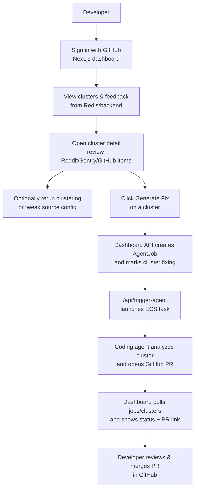
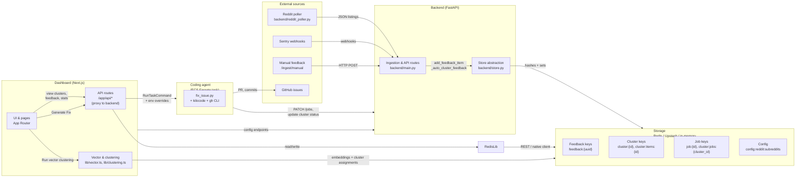
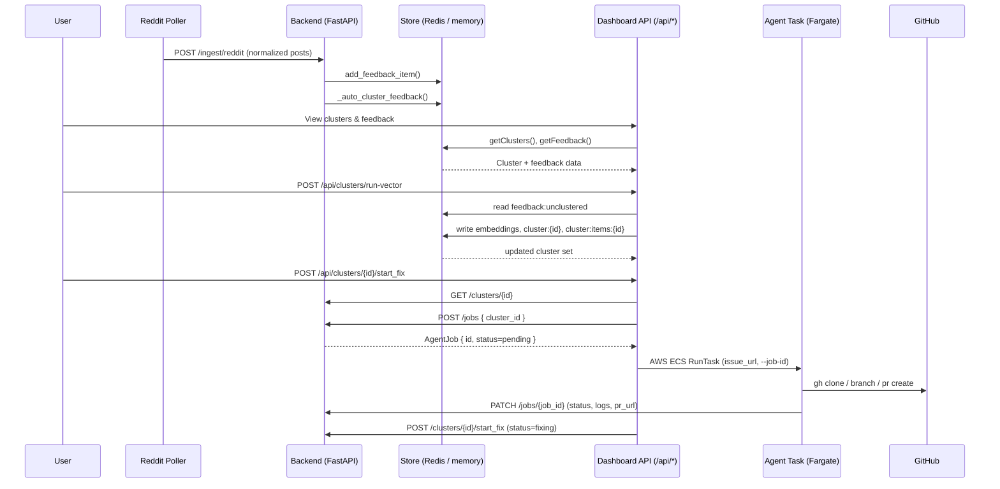

# Soulcaster Architecture — Current State

Snapshot of what the hackathon build actually does today and the big decision points we need to tackle before hardening it. Focus is on the three pillars: ingestion/backend, dashboard, and the coding agent + AWS runner.

## User flow (dashboard to PR)

## High-level architecture (diagram)

## Low-level interactions (diagram)

## End-to-end flow (today)
- Reddit poller (`backend/reddit_poller.py`) scrapes JSON listings without auth, normalizes posts, and posts them to the FastAPI backend at `/ingest/reddit`. Sentry webhooks hit `/ingest/sentry`; manual text goes to `/ingest/manual`.
- Backend (`backend/main.py`) stores feedback via the store abstraction (`backend/store.py`) and auto-clusters by simple heuristics (source + subreddit buckets). No embeddings or LLM-based clustering is wired in yet.
- Storage is either in-memory or Redis/Upstash (hashes + sorted sets + sets; key patterns are in `documentation/db_design.md`). External IDs are deduped via `feedback:external:{source}:{external_id}`.
- Dashboard (Next.js App Router) reads Redis directly via `dashboard/lib/redis.ts` for cluster/feedback lists. It calls the backend only for `/config/reddit/subreddits`, `/clusters/{id}/start_fix`, and `/jobs` creation.
- Clicking “Generate Fix” calls `/api/clusters/[id]/start_fix` (dashboard), which triggers the agent launcher (`/api/trigger-agent`) and then marks the cluster status as `fixing` in the backend.
- The trigger endpoint uses AWS SDK RunTask to start a Fargate task running the coding agent image. It creates/validates a GitHub issue (using the user’s GitHub token via NextAuth, when present), creates a backend job record, and forwards env overrides (GH token, BACKEND_URL, JOB_ID).
- The coding agent container (`coding-agent/fix_issue.py`) forks/clones the target repo via `gh`, runs `kilocode` with the issue context (Gemini provider), commits to a branch, opens a PR, and PATCHes backend job status/logs/PR URL.

## Components (current behavior)
### Backend ingestion + clustering
- FastAPI app in `backend/main.py`; CORS opens to localhost dashboards.
- Endpoints: ingest Reddit/Sentry/manual feedback, list feedback, list clusters, get cluster detail, create job tracking records. `start_fix` simply flips cluster status to `fixing` (no actual agent orchestration here).
- Clustering: `_auto_cluster_feedback` groups by source and subreddit (for Reddit), with canned titles/summaries. No embedding, centroid maintenance, or summarization calls.
- Models in `backend/models.py`; storage abstraction in `backend/store.py` with RedisStore (Upstash REST or redis-py) and InMemoryStore fallback.
- Reddit config is stored in Redis (`config:reddit:subreddits`) with API in `backend/main.py`; poller can read from store or env.

### Storage layer
- Redis schema matches `documentation/db_design.md`: `feedback:{uuid}` hashes plus sorted sets for created/source, `cluster:{id}` hash, `cluster:items:{id}` set, and `clusters:all` set. External dedupe mapping stored separately.
- When Redis env vars are missing or the client fails, backend silently falls back to in-memory dicts (non-durable).
- Dashboard accesses Redis directly (Upstash REST via `@upstash/redis`), so the API surface is split between backend and direct data access.

### Clustering/LLM code (dashboard vector pipeline)
- Dashboard ships vector + clustering utilities (`dashboard/lib/vector.ts`, `dashboard/lib/clustering.ts`) that use Gemini embeddings (`text-embedding-004`, 768 dims) and Upstash Vector to assign clusters with cosine similarity thresholds (0.72 default).
- Manual feedback and GitHub issues ingested via dashboard routes are written directly to Redis and added to a `feedback:unclustered` set; `POST /api/clusters/run-vector` then:
  - Generates embeddings for unclustered items.
  - Uses Upstash Vector to find similar items and assign/join clusters.
  - Writes cluster hashes (`cluster:{id}`), membership sets (`cluster:items:{id}`), and updates `clusters:all`.
  - Marks processed feedback as `clustered: true` and removes IDs from `feedback:unclustered`.
- This pipeline currently operates alongside the backend’s simpler source/subreddit-based clustering for Reddit/Sentry/manual feedback.

### Dashboard + API routes
- Next.js App Router, server components. Data accessors in `dashboard/lib/redis.ts` hydrate clusters/feedback directly from Redis; `app/api/clusters` returns that data to the UI.
- `app/api/trigger-agent` encapsulates AWS ECS RunTask logic and GitHub issue creation/validation. Requires AWS creds, ECS cluster/task/subnet/SG env vars, and a GH token from NextAuth.
- `app/api/clusters/[id]/start_fix` proxies to backend `/clusters/{id}` for context, infers repo owner/name from cluster metadata, triggers `/api/trigger-agent`, and then POSTs to backend `/clusters/{id}/start_fix` to mark status.
- No auth on the backend endpoints; dashboard relies on Vercel env + optional NextAuth GitHub session only for GitHub API access.

### Coding agent
- Single script `coding-agent/fix_issue.py` (invoked via `uv run` locally or as container entrypoint). Depends on `GH_TOKEN`, `GIT_USER_EMAIL`, `GIT_USER_NAME`, and Gemini key; optionally `BACKEND_URL`/`JOB_ID` for status reporting.
- Flow: parse issue URL → ensure fork via `gh repo fork` → clone fork → add upstream → compute base branch via GitHub API → run `kilocode` with issue context → commit/push → open PR via `gh pr create` → update backend job (status/logs/pr_url).
- No repo sandboxing/mocking; runs arbitrary commands against the real repo. No automated test execution unless Kilo prompt triggers it.

### AWS/Fargate path
- Container image built from `coding-agent/Dockerfile` and pushed to ECR (manual per `coding-agent/FARGATE_DEPLOYMENT.md`).
- Terraform in `coding-agent/terraform/` provisions VPC (public subnets), ECS cluster, task definition with Secrets Manager env injection (Gemini + git identity), SG, IAM roles, and CloudWatch log group.
- Dashboard’s `/api/trigger-agent` starts tasks in Fargate with `assignPublicIp=ENABLED`; expects outbound internet to reach GitHub + model provider. No NAT/bastion path.

## Decision points / cleanup backlog
- Data source of truth: pick one interface (backend API vs direct Redis) for the dashboard and cluster logic; decide whether to retire in-memory fallback in production.
- Storage engine: stay on Upstash Redis + Upstash Vector vs move to Postgres + Redis cache (as sketched in `documentation/db_design.md`). Define migration strategy and TTL/retention.
- Clustering: decide on a single canonical clustering path (backend Python vs dashboard TS vs separate worker), unify the naive backend clustering with the vector-based pipeline, and decide whether clustering runs on ingest or via explicit batch jobs. Define thresholds, summarization model, merge/split UX, and centroid persistence.
- Backend vs frontend responsibilities: should cluster creation/status transitions and GitHub metadata live only in backend? Do we expose a single `/api` for the dashboard instead of mixed direct Redis reads?
- Agent invocation: keep Kilo-based patching or move to in-house prompts; enforce pre-flight checks/tests; handle multi-language repos; add guardrails (sandbox, allowlist) before opening PRs.
- GitHub + repo routing: how to map clusters/manual feedback to repos reliably; branch/PR naming conventions; handling multiple repos/owners and permissions (today defaults in env or cluster metadata heuristics).
- AWS path: automate container builds/pushes, consider using GitHub Actions for image updates; decide on networking (private subnets + NAT vs current public), secrets management (Secrets Manager vs env vars in Vercel), and cost controls.
- Observability/testing: add logging/metrics/traces across backend/poller/dashboard/agent; flesh out tests (backend `pytest`, dashboard `npm run test`, agent smoke tests) and add failure surfacing to the UI (job logs, PR links).

---

## Detailed architecture (current behavior)

This section expands the high-level overview into more implementation detail so we can see exactly how pieces talk to each other today.

### Backend service (FastAPI)

- Entry: `backend/main.py`.
- Models: `backend/models.py` defines:
  - `FeedbackItem` — normalized feedback (`source`, `title`, `body`, `metadata`, `created_at`).
  - `IssueCluster` — cluster metadata (title, summary, status, `feedback_ids`, GitHub fields).
  - `AgentJob` — simple job tracker for the coding agent.
- Store abstraction: `backend/store.py` chooses:
  - `RedisStore` when `REDIS_URL` or `UPSTASH_REDIS_URL` or `UPSTASH_REDIS_REST_URL` are set and usable.
  - `InMemoryStore` otherwise (non-persistent, process-local).

### Project Scoping (project_id handling)

- All feedback, clusters, and jobs are now scoped to a `project_id` (string, supporting both UUID and CUID formats from the dashboard).
- Redis keys follow project-scoped patterns:
  - `feedback:{project_id}:{uuid}` for individual feedback items
  - `feedback:created:{project_id}` for creation-time sorted sets
  - `feedback:source:{project_id}:{source}` for per-source indexes
  - `feedback:external:{project_id}:{source}:{external_id}` for deduplication lookups
  - `cluster:{project_id}:{id}` for cluster metadata
  - `cluster:items:{project_id}:{cluster_id}` for cluster membership sets
  - `clusters:{project_id}:all` for cluster ID listings
- The dashboard passes `project_id` in all proxy requests to backend endpoints (as query parameter or in request body).
- The backend uses `project_id` to isolate and filter data per project throughout the storage layer. All store methods accept `project_id` parameters to scope lookups, writes, and deletions to the correct project namespace.

**Key endpoints (today)**
- Ingestion:
  - `POST /ingest/reddit`:
    - Body: `FeedbackItem` JSON produced by the Reddit poller.
    - Dedupes on `(source, external_id)` using `get_feedback_by_external_id`.
    - On new items: `add_feedback_item(item)` then `_auto_cluster_feedback(item)`.
  - `POST /ingest/sentry`:
    - Body: raw Sentry event JSON.
    - Extracts `event_id`, title, exception type/value, top 3 stack frames, builds `FeedbackItem`.
    - Stores + clusters.
  - `POST /ingest/manual`:
    - Body: `{ "text": string }`.
    - Creates `FeedbackItem` with `source="manual"`, title truncated to 80 chars, empty metadata.
    - Stores + clusters.

- Feedback reads:
  - `GET /feedback`:
    - Optional `source`, `limit`, `offset`.
    - Reads all items from store, filters and paginates in-memory.
  - `GET /feedback/{id}`:
    - Returns single `FeedbackItem` or 404.

- Clusters:
  - `GET /clusters`:
    - Reads all `IssueCluster` entries from store (Redis or memory).
    - For each cluster:
      - Hydrates `feedback_items` by reading `FeedbackItem` for each `feedback_id` (UUID).
      - Derives `sources` set from hydrated items.
    - Returns a flattened array for frontend consumption.
  - `GET /clusters/{id}`:
    - Returns `IssueCluster` plus `feedback_items`.
  - `POST /clusters/{id}/start_fix`:
    - Only updates `IssueCluster.status` to `"fixing"`.
    - All ECS / GitHub logic lives in the dashboard layer.

- Jobs:
  - `POST /jobs`:
    - Body: `{ "cluster_id": string }`.
    - Creates an `AgentJob` in `"pending"` status with timestamps.
  - `PATCH /jobs/{job_id}`:
    - Body: `{ status?: "pending" | "running" | "success" | "failed", logs?: string }`.
    - Merges provided fields into existing job and updates `updated_at`.
  - `GET /jobs`, `GET /jobs/{job_id}`, `GET /clusters/{cluster_id}/jobs` expose job listings.

- Config and poller integration:
  - `GET /config/reddit/subreddits` / `POST /config/reddit/subreddits`:
    - Reads/writes a global subreddit list backed by Redis (`config:reddit:subreddits`) or memory.
  - `POST /admin/trigger-poll`:
    - Reads configured subreddits (store -> `reddit_poller.get_configured_subreddits()`).
    - Invokes `reddit_poller.poll_once` in a thread pool with a `direct_ingest` callback that:
      - Creates `FeedbackItem` from poller payload dict.
      - Calls `add_feedback_item` + `_auto_cluster_feedback`.

**Clustering logic (backend)**
- `_auto_cluster_feedback(item)`:
  - Determines cluster title/summary:
    - Reddit: `"Reddit: r/{subreddit}"` and `"Reports from r/{subreddit}"`.
    - Sentry: `"Sentry issues"` and a generic summary.
    - Manual: `"Manual feedback"`.
  - Scans all clusters to find one with exactly the same `title`.
  - If found:
    - Appends stringified `item.id` to `feedback_ids` (if not already present).
    - Updates `updated_at`.
  - Else:
    - Creates a new `IssueCluster` with a single `feedback_ids` element and status `"new"`.
- There is no embedding, similarity threshold, or LLM summarization here yet.

### Storage layer (Redis vs in-memory)

**InMemoryStore**
- Plain dict-backed store that implements:
  - Feedback: `add_feedback_item`, `get_feedback_item`, `get_all_feedback_items`, `clear_feedback_items`, `get_feedback_by_external_id`.
  - Clusters: `add_cluster`, `get_cluster`, `get_all_clusters`, `update_cluster`, `clear_clusters`.
  - Jobs: `add_job`, `get_job`, `update_job`, `get_jobs_by_cluster`, `get_all_jobs`, `clear_jobs`.
  - Config: `set_reddit_subreddits`, `get_reddit_subreddits`, `clear_config`.
- All operations are O(n) over Python dicts; data disappears when the process restarts.

**RedisStore (Upstash-compatible)**
- Connects via either:
  - `redis.from_url(REDIS_URL/UPSTASH_REDIS_URL)` (native client), or
  - Custom Upstash REST client using `UPSTASH_REDIS_REST_URL` + `UPSTASH_REDIS_REST_TOKEN`.
- Uses hashes, sorted sets, and sets:
  - Feedback:
    - Hash: `feedback:{uuid}` with ISO timestamps and metadata JSON.
    - Sorted sets: `feedback:created`, `feedback:source:{source}`.
    - String: `feedback:external:{source}:{external_id}` for dedupe.
  - Clusters:
    - Hash: `cluster:{cluster_id}` with metadata (no `feedback_ids`).
    - Set: `cluster:items:{cluster_id}` for `feedback_ids`.
    - Set: `clusters:all` for listing cluster IDs.
  - Jobs:
    - Hash: `job:{job_id}`.
    - Sorted set: `cluster:jobs:{cluster_id}` for listing jobs per cluster.
  - Config:
    - String: `config:reddit:subreddits` as JSON array.
- The public functions in `store.py` (`add_feedback_item`, `add_cluster`, etc.) hide the backing choice from the rest of the backend.

### Dashboard service (Next.js)

- Proxies feedback/clusters/stats and Reddit config to the backend; backend is the single source of truth for those reads/writes.
- Vector clustering routes (`/api/clusters/run`, `/api/clusters/run-vector`) still talk directly to Upstash Redis/Vector for embeddings and batch writes (legacy path).

**API routes**
- `GET /api/clusters`, `GET /api/clusters/[id]`, `GET /api/feedback`, `PUT /api/feedback`, `GET /api/stats`, `GET/POST /api/config/reddit/subreddits`:
  - Proxy to backend (`BACKEND_URL`) with `project_id`.
- `POST /api/clusters/[id]/start_fix`:
  - Fetches cluster from backend (`GET {BACKEND_URL}/clusters/{id}`) to leverage backend’s notion of cluster fields.
  - Deduces repo owner/name from `github_repo_url` or defaults (for manual clusters).
  - Calls `POST /api/trigger-agent` with issue + repo context plus `cluster_id`.
  - If that succeeds, calls `POST {BACKEND_URL}/clusters/{id}/start_fix` to set status to `"fixing"`.
**GitHub Integration: Manual vs. Automated Ingestion**

- **Manual triggering (via dashboard)**: `POST /api/trigger-agent`:
  - Operation order: (1) Creates or validates a GitHub issue using the user's Octokit token (from NextAuth session), (2) Creates a backend job record (`POST {BACKEND_URL}/jobs`) when `cluster_id` is provided, then (3) Starts a Fargate task via `RunTaskCommand` with:
    - Command: `[issue_url, '--job-id', job_id]` or `[issue_url]`.
    - Env: `BACKEND_URL`, `JOB_ID` (if any), and `GH_TOKEN` (if user is authenticated).
  - Used when a user clicks "Generate Fix" on a cluster from the dashboard UI.

- **Automated syncing (backend)**: `POST /ingest/github/sync/{repo_name}`:
  - Operation order: (1) Fetches open issues from the specified GitHub repo (using optional `X-GitHub-Token` header for higher API rate limits), (2) Deduplicates by `external_id` using `get_feedback_by_external_id`, and (3) Auto-clusters them via `_auto_cluster_feedback` alongside other feedback sources (Reddit, Sentry, manual).
  - Accepts `project_id` as query parameter and stores all feedback items scoped to that project.
  - Intended for scheduled polling of external repos (can be triggered manually from dashboard's `/api/ingest/github/sync/[name]` proxy endpoint).
  - Both paths are now clearly distinguished: manual triggering is for user-initiated agent runs, while automated syncing is for bulk issue ingestion.

### Clustering and vector store (TS-side pipeline)

- `dashboard/lib/clustering.ts`:
  - Implements pure math helpers:
    - `cosineSimilarity(embedding1, embedding2)`.
    - `calculateCentroid(embeddings)`.
    - `findBestCluster(embedding, clusters, threshold)`.
  - Provides `ClusteringBatch` for batched, incremental updates of centroids and Redis operations.
- `dashboard/lib/vector.ts`:
  - Wraps `@upstash/vector` and `GoogleGenAI` embedding API.
  - Offers:
    - `generateFeedbackEmbedding(feedback)` and batch variants.
    - `clusterWithVectorDB` and `processNewFeedbackWithVector`, which:
      - Query vector store for similar items.
      - Decide whether to join an existing cluster or create a new one.
      - Persist embeddings + cluster IDs in the vector index.
  - Combined with the `feedback:unclustered` set and `/api/clusters/run-vector`, this forms the active clustering path for dashboard-ingested feedback (manual + GitHub), while backend-ingested feedback still uses the simpler Python clustering.

### Coding agent and AWS Fargate

- `coding-agent/fix_issue.py`:
  - Uses `gh` CLI heavily to:
    - Discover user (`gh api user`).
    - Ensure a fork exists with a unique name (`aie-fork-{repo}-{suffix}`).
    - Query repo default branch (`gh repo view ...`).
    - Open the final PR (`gh pr create`).
  - Uses Kilo CLI (`kilocode`) to drive the actual code edits based on the GitHub issue body.
  - Uses `update_job` helper to push job status/logs/PR URL back to backend over HTTP.
- AWS path:
  - Dockerfile in `coding-agent/` builds the image.
  - Terraform in `coding-agent/terraform/` sets up:
    - VPC + subnets + security group.
    - ECS cluster and task definition.
    - IAM and CloudWatch.
  - `FARGATE_DEPLOYMENT.md` documents the manual steps to:
    - Build and push the image to ECR.
    - Configure secrets in AWS Secrets Manager.
    - Wire ECS env into dashboard (`ECS_CLUSTER_NAME`, `ECS_TASK_DEFINITION`, etc.).

---

This detailed section is meant to describe “what is actually running” rather than “what we want.” As we iterate, we can annotate which pieces are legacy/hackathon vs. v1 target behavior and then update the PRD to match. 
