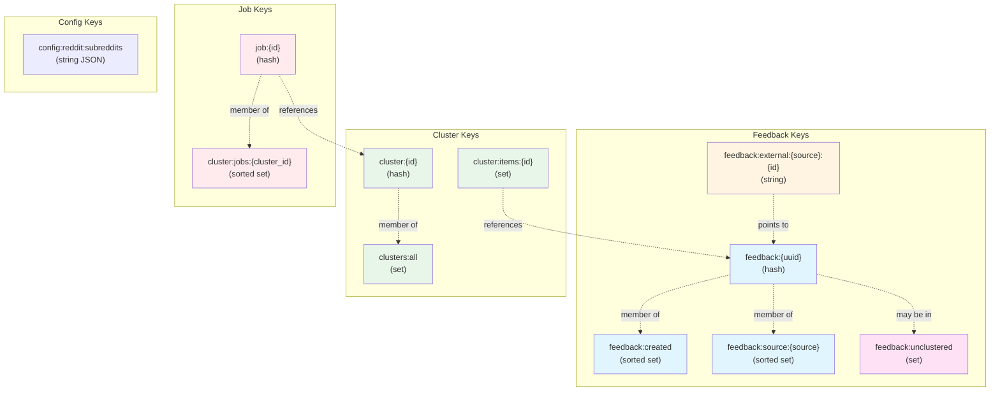
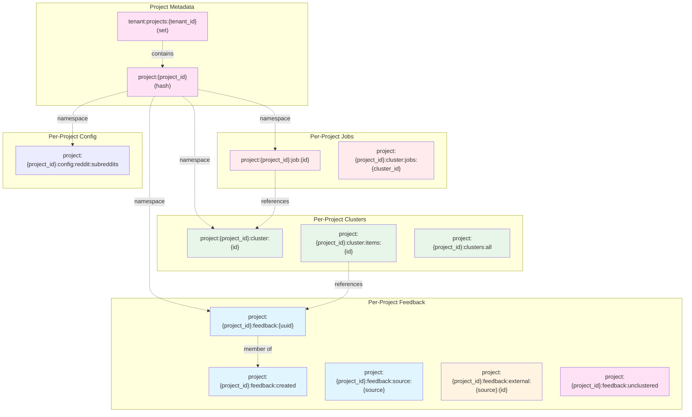
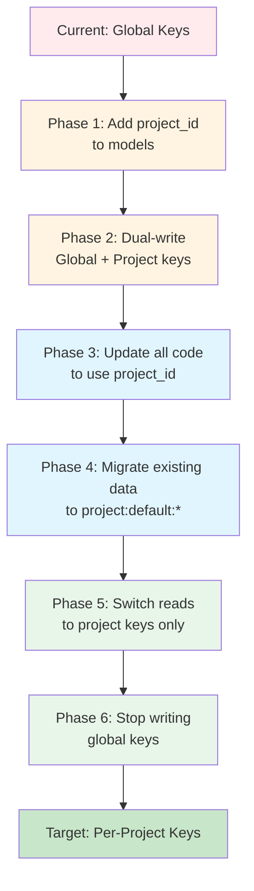
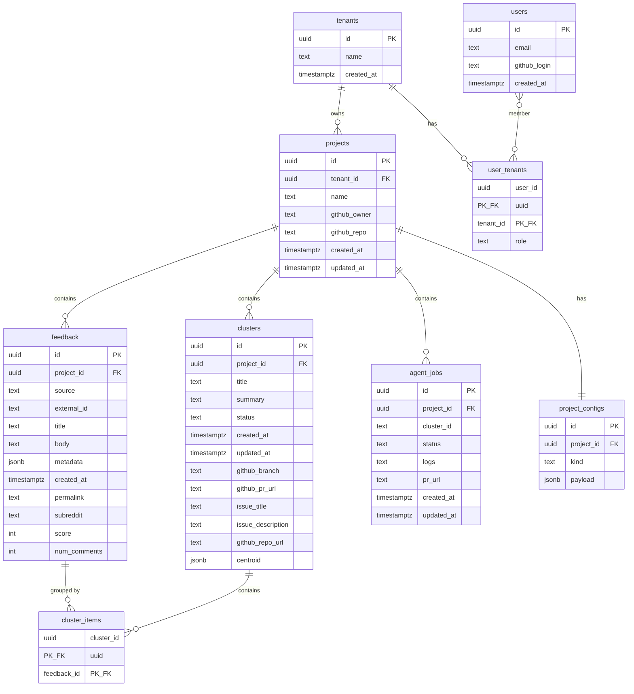

# Database Design — From Hackathon Redis to Multi‑Tenant Model

This document replaces the original hackathon Redis sketch with a design that:

- Describes what’s implemented **today** (global Redis keyspace).
- Defines a more sensible **user / project / artifact** model for multi‑tenant use.
- Outlines a path to **per‑project isolation** and a future Postgres schema.

The goal is to preserve the current truth while giving us a clear target that supports multiple users, multiple projects, and coding agents per project.

---

## 1. Concepts & Requirements

```mermaid
erDiagram
    TENANT ||--o{ PROJECT : owns
    USER }o--o{ TENANT : "belongs to"
    PROJECT ||--o{ FEEDBACK : contains
    PROJECT ||--o{ CLUSTER : contains
    PROJECT ||--o{ JOB : contains
    PROJECT ||--|| CONFIG : has
    CLUSTER ||--o{ FEEDBACK : groups
    JOB }o--|| CLUSTER : "fixes"
    
    TENANT {
        uuid id PK
        string name
        timestamp created_at
    }
    
    USER {
        uuid id PK
        string email
        string github_login
    }
    
    PROJECT {
        uuid id PK
        uuid tenant_id FK
        string name
        string github_owner
        string github_repo
    }
    
    FEEDBACK {
        uuid id PK
        uuid project_id FK
        string source
        string external_id
        string title
        text body
    }
    
    CLUSTER {
        uuid id PK
        uuid project_id FK
        string title
        text summary
        string status
    }
    
    JOB {
        uuid id PK
        uuid project_id FK
        string cluster_id
        string status
    }
    
    CONFIG {
        uuid project_id PK_FK
        jsonb settings
    }
```

### 1.1 Core entities

- **User**
  - Typically a GitHub user (via OAuth) or a Soulcaster account.
  - Belongs to one or more tenants (organizations) and projects.
- **Tenant / Organization**
  - Logical owner of projects (e.g., a company or team).
  - Used for billing, policy, and data isolation at the org level.
- **Project**
  - Logical workspace in Soulcaster.
  - Usually maps 1:1 to a GitHub repo (`owner/repo`) or a product area.
  - All feedback, clusters, jobs, and config are scoped to a project.
- **Feedback**
  - Normalized events from Reddit, Sentry, manual forms, GitHub issues, etc.
  - Belong to a single project.
- **Cluster (IssueCluster)**
  - Group of related feedback items within a project.
  - May be linked to a GitHub issue and/or PR.
- **AgentJob**
  - Background job for the coding agent associated with a project + cluster.
  - Tracks status, logs, PR URL.
- **Config**
  - Per‑project configuration (sources, Reddit subreddits, thresholds, etc.).

### 1.2 High‑level requirements

- **Multi‑tenant**
  - Partition data by tenant and project.
  - Support multiple users collaborating on the same project.
- **Per‑project isolation**
  - Feedback, clusters, jobs, config must not mix across projects.
  - Easy to delete/export data per project or per tenant.
- **Backwards compatibility**
  - Current Redis keys are global; we must evolve toward namespaced keys without breaking existing code immediately.
- **RDBMS‑ready**
  - Design table shapes now so moving to Postgres later is straightforward.

---

## 2. Current Hackathon Redis Model (truth today)



Today's implementation (via `backend/store.py` and dashboard helpers) uses a **global** Redis keyspace:

### 2.1 Keys currently in use

- **Feedback**
  - `feedback:{uuid}` (hash):
    - Fields: `id`, `source`, `external_id`, `title`, `body`, `metadata` (JSON), `created_at`, optional `github_repo_url`, `clustered`.
  - `feedback:created` (sorted set):
    - Members: `uuid`, score: epoch seconds (recent‑first listing).
  - `feedback:source:{source}` (sorted set):
    - Members: `uuid`, score: epoch seconds.
  - `feedback:external:{source}:{external_id}` (string):
    - Value: `uuid` to deduplicate by external ID.
  - `feedback:unclustered` (set):
    - Feedback IDs pending vector clustering (dashboard path).
  - **GitHub ingestion (current)**:
    - Backend endpoint `/ingest/github/sync/{owner/repo}` normalizes issues to `FeedbackItem` (`source="github"`) and writes via `add_feedback_item()`.
    - Pull requests are filtered out; closed issues are removed from `feedback:unclustered` after ingestion.
    - Deduplication uses `feedback:external:github:{external_id}` (external_id = GitHub issue id). `last_synced` is tracked in-process for now; promote to Redis when persistence is required.

- **Clusters**
  - `cluster:{cluster_id}` (hash):
    - Fields: `id`, `title`, `summary`, `status`, `created_at`, `updated_at`,
      `github_branch`, `github_pr_url`, `issue_title`, `issue_description`,
      `github_repo_url`, optional `centroid` (JSON‑encoded embedding).
  - `cluster:items:{cluster_id}` (set):
    - Feedback IDs belonging to that cluster.
  - `clusters:all` (set):
    - All cluster IDs (used for listing).

- **Jobs**
  - `job:{job_id}` (hash):
    - Fields from `AgentJob`: `id`, `cluster_id`, `status`, `logs`, `pr_url`, `created_at`, `updated_at`.
  - `cluster:jobs:{cluster_id}` (sorted set):
    - Members: `job_id`, score: epoch seconds (per‑cluster job history).

- **Config**
  - `config:reddit:subreddits` (string JSON array):
    - Global subreddit list for the Reddit poller + dashboard SourceConfig UI.

### 2.2 Behavior today

- Feedback:
  - Insert + dedupe by `(source, external_id)`.
  - Recent listing via `feedback:created`.
  - Source filtering via `feedback:source:{source}`.
  - Vector clustering uses `feedback:unclustered` (global).
- Clusters:
  - Both backend and dashboard write `cluster:*` and `clusters:all` without project scoping.
- Jobs:
  - There is a single global job space; jobs are linked to clusters via `cluster_id` only.
- Config:
  - Reddit subreddits are global, not per project.
- Access patterns:
  - Dashboard API routes now proxy feedback/clusters/stats/config through the backend; backend is the single source of truth for these reads/writes.
  - Vector clustering routes (`/api/clusters/run`, `/api/clusters/run-vector`) still touch Redis/Vector directly (legacy path).

This works for a single demo or sandbox but is **not** tenant‑safe: every user/project shares the same keyspace.

---

## 3. Target Multi‑Tenant Redis Model



We introduce a stable identifier `project_id` (string/UUID) for each project and treat it as the primary partition. Keys are namespaced by project, and projects are grouped by tenant.

### 3.1 Project and tenant metadata

- `project:{project_id}` (hash)
  - `id`, `tenant_id`, `name`, `github_owner`, `github_repo`, `created_at`, `updated_at`, optional `metadata` JSON.
- `tenant:projects:{tenant_id}` (set)
  - Members: `project_id` values owned by the tenant.

User and tenant identities may ultimately live in Postgres/auth; Redis only needs enough metadata to partition and list projects.

### 3.2 Feedback (per project)

- `project:{project_id}:feedback:{uuid}` (hash)
  - Fields: `id`, `project_id`, `source`, `external_id`, `title`, `body`, `metadata` JSON, `created_at`, `github_repo_url`, `clustered`, etc.

- `project:{project_id}:feedback:created` (sorted set)
  - Members: `uuid`, score: epoch seconds.

- `project:{project_id}:feedback:source:{source}` (sorted set)
  - Members: `uuid`, score: epoch seconds.

- `project:{project_id}:feedback:external:{source}:{external_id}` (string)
  - Value: `uuid` (dedupe guard within a project).

- `project:{project_id}:feedback:unclustered` (set)
  - Feedback IDs pending vector clustering for that project.

### 3.3 Clusters (per project)

- `project:{project_id}:cluster:{cluster_id}` (hash)
  - Fields: `id`, `project_id`, `title`, `summary`, `status`, `created_at`, `updated_at`,
    `github_branch`, `github_pr_url`, `issue_title`, `issue_description`,
    `github_repo_url`, optional `centroid` (JSON‑encoded vector).

- `project:{project_id}:cluster:items:{cluster_id}` (set)
  - Members: feedback IDs belonging to the cluster.

- `project:{project_id}:clusters:all` (set)
  - Members: `cluster_id` values for that project (cluster listing).

### 3.4 Jobs (per project & cluster)

- `project:{project_id}:job:{job_id}` (hash)
  - Fields: `id`, `project_id`, `cluster_id`, `status`, `logs`, `pr_url`, `created_at`, `updated_at`.

- `project:{project_id}:cluster:jobs:{cluster_id}` (sorted set)
  - Members: `job_id`, score: epoch seconds.

- Optional:
  - `project:{project_id}:jobs:all` (sorted set)
    - Members: `job_id`, score: epoch seconds (per‑project job listing).

### 3.5 Config (per project)

- `project:{project_id}:config:reddit:subreddits` (string JSON array)
  - Per‑project subreddit list for the poller.

- `project:{project_id}:config:sources` (hash or JSON)
  - Generic per‑project config for ingestion, thresholds, etc.

---

## 4. Core Operations in the Target Model

All key operations are now explicitly scoped by `project_id`.

### 4.1 Insert feedback

Inputs:

- `project_id`
- `source` (`reddit`, `sentry`, `manual`, `github`, etc.)
- `external_id` (optional but preferred)
- `title`, `body`, `metadata`, `created_at`

Steps:

1. Check `project:{project_id}:feedback:external:{source}:{external_id}`:
   - If present, return existing feedback (dedupe within project).
2. Write `project:{project_id}:feedback:{uuid}` (hash).
3. Add to `project:{project_id}:feedback:created` with score = `created_at` or `now`.
4. Add to `project:{project_id}:feedback:source:{source}`.
5. If `external_id` set, write `project:{project_id}:feedback:external:{source}:{external_id}` → `uuid`.
6. Optionally add `uuid` to `project:{project_id}:feedback:unclustered`.

### 4.2 List / filter feedback

- Recent in project:
  - `ZRANGE project:{project_id}:feedback:created` with pagination, hydrating each feedback hash.
- Filter by source:
  - `ZRANGE project:{project_id}:feedback:source:{source}`.

### 4.3 Clustering

- Backend auto‑clustering:
  - `_auto_cluster_feedback(project_id, item)`:
    - Finds or creates a cluster in `project:{project_id}:cluster:*`.
    - Adds feedback ID to `project:{project_id}:cluster:items:{cluster_id}`.
    - Ensures `cluster_id` is in `project:{project_id}:clusters:all`.

- Dashboard vector clustering:
  - Reads `project:{project_id}:feedback:unclustered`.
  - Uses Upstash Vector + embeddings to assign clusters.
  - Writes to project‑scoped `cluster` hashes and `cluster:items` sets.
  - Marks feedback as clustered and removes IDs from `feedback:unclustered`.

### 4.4 Jobs

- Create:
  - Write `project:{project_id}:job:{job_id}`.
  - Add `job_id` to `project:{project_id}:cluster:jobs:{cluster_id}`.
  - Optionally add to `project:{project_id}:jobs:all`.

- Read:
  - By ID: `HGETALL project:{project_id}:job:{job_id}`.
  - By cluster: `ZRANGE project:{project_id}:cluster:jobs:{cluster_id}`.
  - By project: `ZRANGE project:{project_id}:jobs:all`.

---

## 5. Migration Strategy: Global → Per‑Project



We don't need to break the world to get to a better model. A pragmatic path:

1. **Add `project_id` to backend models**
   - Extend `FeedbackItem`, `IssueCluster`, and `AgentJob` with a `project_id` field.
   - For existing data, default to a sentinel like `"default"` or derive from a single configured repo.

2. **Evolve `backend/store.py` behind the same API**
   - Keep public functions (`add_feedback_item`, `get_all_clusters`, `add_job`, etc.) but:
     - When `project_id` is present, write to `project:{project_id}:*` keys.
     - In a first phase, optionally **also** maintain the existing global keys for backward compatibility.

3. **Update backend + dashboard to set `project_id` everywhere**
   - When ingesting feedback, creating clusters, or spawning jobs:
     - Resolve the project from:
       - GitHub repo (`owner/repo` → `project_id`).
       - Or a project selector in the dashboard.

4. **Migrate existing global data**
   - One‑time script:
     - Read global `feedback:*`, `cluster:*`, `job:*`.
     - Write them into a “default project” namespace (`project:default:*`).
   - After migration, new data uses project‑scoped keys only.

5. **Retire global keys**
   - Once all code is project‑aware and data is migrated, stop writing global keys and optionally delete them.

---

## 6. Future Postgres Schema (Multi‑Tenant)



When we move to Postgres, the schema should mirror the user/project/artifact structure:

- `tenants(id uuid pk, name text, created_at timestamptz, ...)`
- `users(id uuid pk, email text, github_login text, created_at timestamptz, ...)`
- `user_tenants(user_id uuid fk, tenant_id uuid fk, role text, primary key (user_id, tenant_id))`

- `projects(id uuid pk, tenant_id uuid fk, name text, github_owner text, github_repo text, created_at timestamptz, updated_at timestamptz)`
- `feedback(id uuid pk, project_id uuid fk, source text, external_id text, title text, body text, metadata jsonb, created_at timestamptz, permalink text, subreddit text, score int, num_comments int, UNIQUE(project_id, source, external_id))`
- `clusters(id uuid pk, project_id uuid fk, title text, summary text, status text, created_at timestamptz, updated_at timestamptz, github_branch text, github_pr_url text, issue_title text, issue_description text, github_repo_url text, centroid jsonb)`
- `cluster_items(cluster_id uuid fk, feedback_id uuid fk, primary key (cluster_id, feedback_id))`
- `agent_jobs(id uuid pk, project_id uuid fk, cluster_id text, status text, logs text, pr_url text, created_at timestamptz, updated_at timestamptz)`
- `project_configs(id uuid pk, project_id uuid fk, kind text, payload jsonb)`

Indexes:

- `feedback(project_id, created_at desc)`
- `feedback(project_id, source, created_at desc)`
- `feedback(project_id, source, external_id)`
- `clusters(project_id, status, updated_at desc)`
- `agent_jobs(project_id, created_at desc)`
- `agent_jobs(project_id, cluster_id, created_at desc)`

This gives us a clean path to mirror Redis → Postgres with a background migration job.

---

## 7. Deployment & Testing Notes

- **Redis / Upstash**
  - In the transition period, we can:
    - Continue reading from the old global keys for legacy data.
    - Start writing new data into project‑scoped keys.
  - For multi‑tenant SaaS, consider:
    - One logical DB per environment, with project namespaces per tenant.
    - Or one DB per tenant in extreme isolation scenarios.

- **Testing**
  - Add tests that:
    - Verify dedupe is per project via `feedback:external`.
    - Ensure `project_a` data never leaks into `project_b` when listing feedback/clusters/jobs.
    - Confirm migration logic from global to `project:default:*` works.
  - Keep public `backend/store.py` signatures stable while we refactor internals.

For an end‑to‑end view of how this ties into clustering and the coding agent, see `documentation/current_architecture.md` and `documentation/coding_agent_sandbox_architecture.md`.

