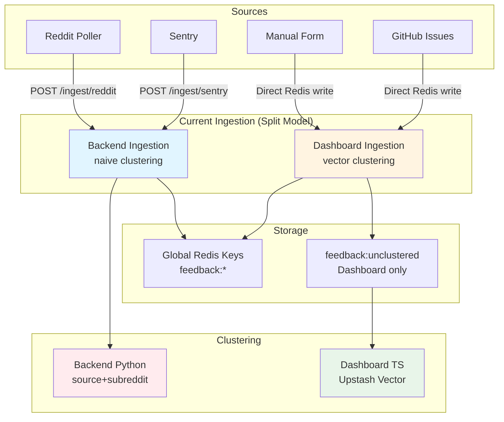
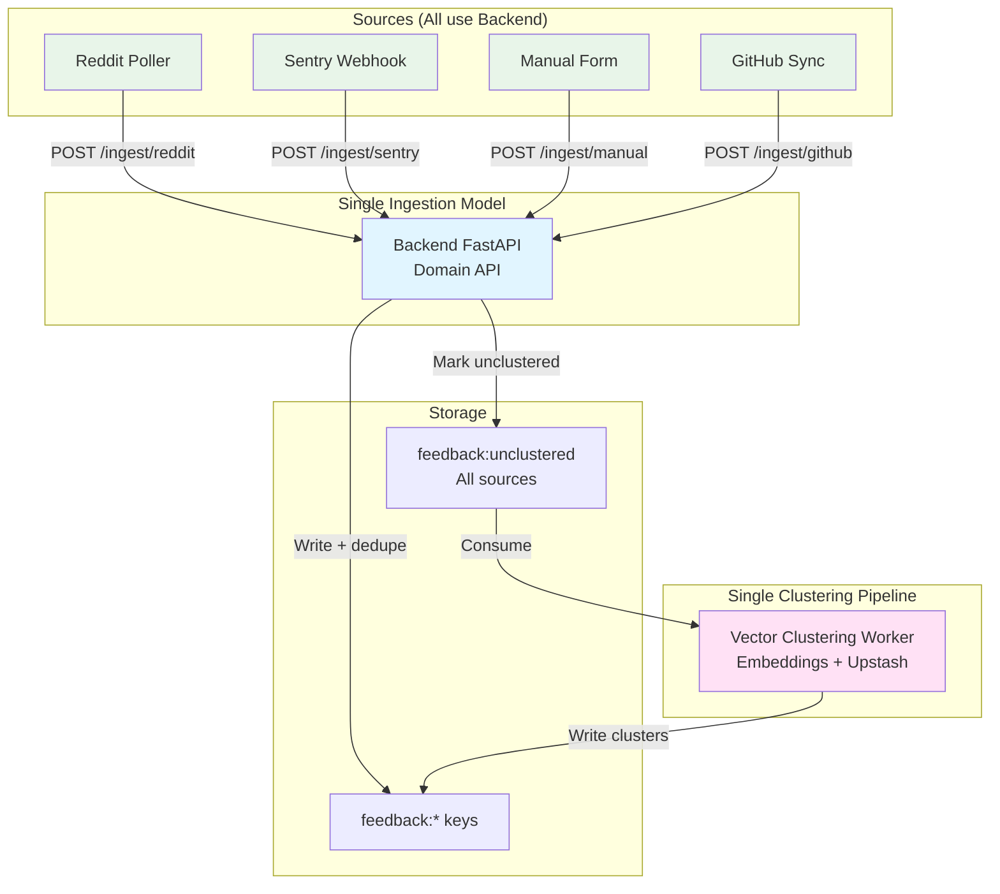
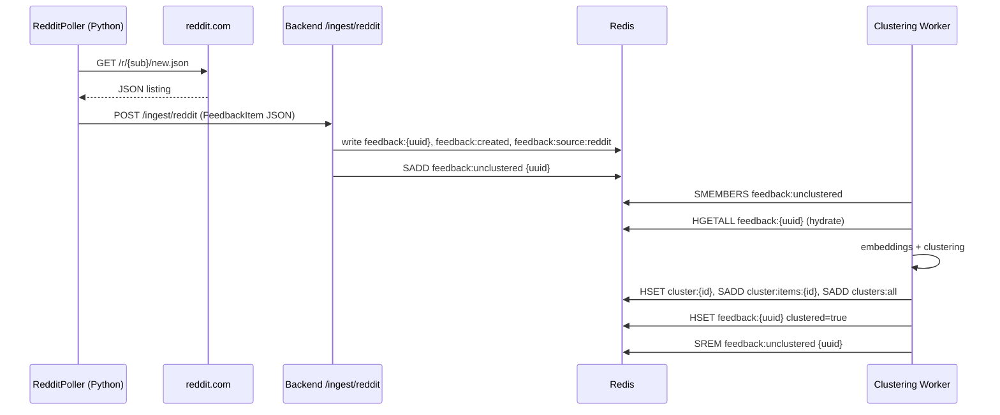
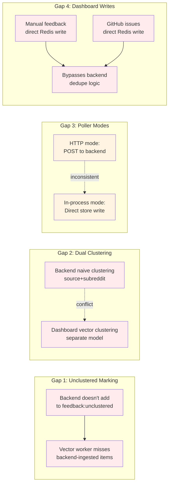
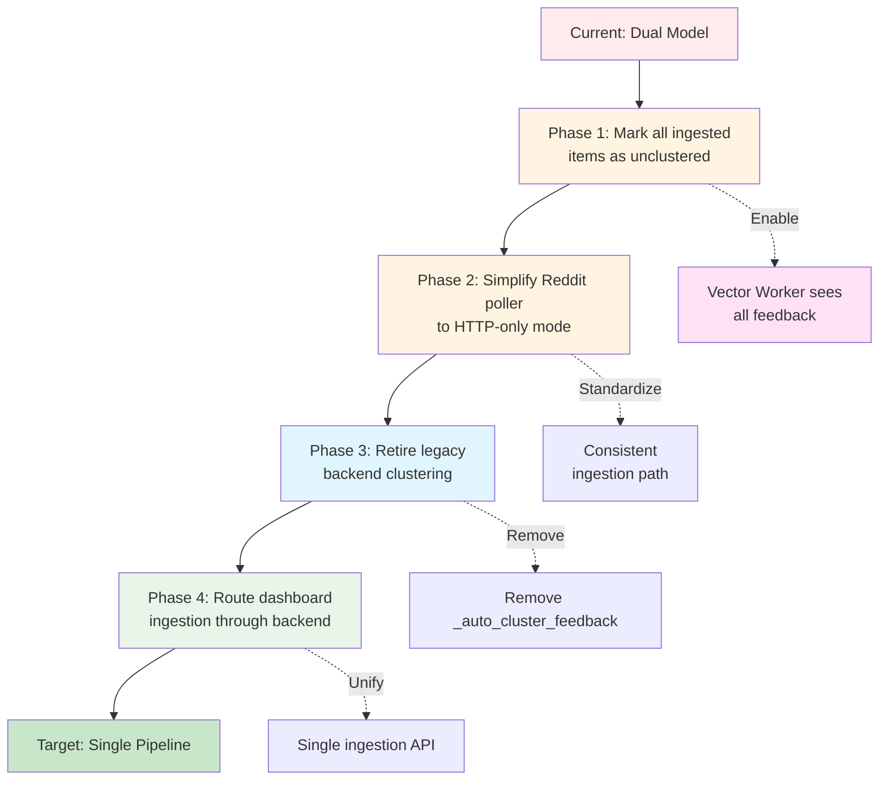

# Ingestion & Polling Architecture Plan

This document proposes a target architecture and migration plan for Soulcaster’s ingestion and Reddit polling pipeline. It is meant to sit alongside `documentation/current_architecture.md` (current state) and `documentation/db_design.md` (data model).

The goals are:
- Align the mental model (“everything is a `FeedbackItem` that eventually gets clustered with vectors”) with the actual execution.
- Make the Reddit poller predictable and easy to operate.
- Ensure all feedback, regardless of source, can flow into the same clustering path.

---

## 1. Mental Model (Target)

At a high level:

- **Backend (FastAPI) is the ingestion service of record.**
  - All external systems (Reddit poller, Sentry, manual forms, GitHub sync) talk to the backend, not directly to Redis.
  - Backend is responsible for dedupe and writing normalized `FeedbackItem` records to Redis (`feedback:{uuid}`, `feedback:created`, `feedback:source:{source}`, `feedback:external:{source}:{external_id}`).

- **Clustering is asynchronous and decoupled from ingest.**
  - Ingest only normalizes and stores feedback.
  - A separate “clustering worker” consumes unclustered feedback and assigns it to clusters using embeddings + Upstash Vector.

- **Reddit poller is “just another producer” of `FeedbackItem`s.**
  - Poller uses the same `/ingest/reddit` backend endpoint as any other producer.
  - Poller configuration (subreddits, sorts, interval) is driven by backend/Redis, not hardcoded.

- **All ingestion paths mark “needs clustering” in a consistent way.**
  - Any new feedback (Reddit/Sentry/manual/GitHub) is added to `feedback:unclustered`.
  - The clustering worker is the single consumer of `feedback:unclustered`.

This results in:

```mermaid
flowchart LR
  subgraph Sources
    R[Reddit poller\nbackend/reddit_poller.py]
    S[Sentry webhook]
    M[Manual feedback\nUI + API]
    G[GitHub issues\nsync worker]
  end

  subgraph Backend[Backend (FastAPI)]
    Ingest[/Ingestion endpoints\n/ingest/*/]
  end

  subgraph Storage[Redis / Upstash]
    FKeys[feedback:{uuid}\nfeedback:created\nfeedback:source:{source}\nfeedback:unclustered]
  end

  subgraph Clustering[Vector clustering worker]
    VC[Vector + Gemini\n/lib/vector.ts\n/api/clusters/run-vector]
  end

  R -->|normalized FeedbackItem JSON| Ingest
  S -->|event JSON| Ingest
  M -->|manual body| Ingest
  G -->|normalized issues| Ingest

  Ingest -->|dedupe + write| FKeys
  FKeys -->|unclustered IDs| VC
  VC -->|cluster:{id}, cluster:items:{id}\nclusters:all| Storage
```

---

## 2. Current State (High-Level)



See `documentation/current_architecture.md` for the full snapshot; key ingestion/polling facts today:

- **Backend ingestion (`backend/main.py`):**
  - `POST /ingest/reddit` / `/ingest/sentry` / `/ingest/manual` normalize to `FeedbackItem`, dedupe on `(source, external_id)`, and write via `backend/store.py`.
  - Each ingest **synchronously** calls `_auto_cluster_feedback`, which groups items into naive clusters by source + subreddit/title. No embeddings or vector store are involved here.

- **Reddit poller (`backend/reddit_poller.py`):**
  - Polls JSON endpoints for configured subreddits and sorts.
  - For each post, builds a `FeedbackItem`-shaped payload and **either**:
    - POSTs to `BACKEND_URL/ingest/reddit`, or
    - When triggered via `/admin/trigger-poll`, uses an in-process `ingest_fn` callback to write directly via `add_feedback_item` + `_auto_cluster_feedback`.
  - Subreddit config primarily comes from Redis (`config:reddit:subreddits`) with env-var fallback.

- **Dashboard ingestion + clustering (Next.js):**
  - Manual feedback and GitHub issues ingested via dashboard routes are written **directly to Redis** via `dashboard/lib/redis.ts#createFeedback`.
  - Those routes add IDs to `feedback:unclustered`, and `/api/clusters/run-vector` (vector worker) processes that set, using `dashboard/lib/vector.ts` + Upstash Vector.
  - Backend-ingested feedback does **not** currently join `feedback:unclustered`, so it is not part of the vector-based clustering path.

This split is the core source of confusion: there are effectively **two ingestion models** (backend vs dashboard) and **two clustering models** (naive Python vs vector TS).

---

## 3. Target Ingestion & Polling Architecture



### 3.1 Responsibilities by Component

- **Backend (FastAPI)**
  - Owns the canonical `FeedbackItem` model.
  - Owns ingestion endpoints for all sources (`/ingest/reddit`, `/ingest/sentry`, `/ingest/manual`, optional `/ingest/github`).
  - Owns write access to Redis for feedback keys (`feedback:*`) and the `feedback:unclustered` set.
  - Does **not** run heavy clustering inline on request; at most tags metadata for later clustering.

- **Reddit Poller (Python worker)**
  - Stateless process or container that:
    - Reads config from backend (`GET /config/reddit/subreddits`) and env (poll interval, sorts).
    - Calls `POST /ingest/reddit` for new posts.
  - Does not touch Redis directly and does not reimplement any clustering logic.

- **Clustering Worker (Vector-based)**
  - Responsible for:
    - Periodically reading `feedback:unclustered`.
    - Generating embeddings and assigning items to clusters using Upstash Vector + Gemini.
    - Writing cluster keys (`cluster:{id}`, `cluster:items:{id}`, `clusters:all`) and marking `feedback:{id}` as `clustered=true`.
  - Can remain implemented as a Next.js route (`/api/clusters/run-vector`) or be extracted into a dedicated worker, but from an ingestion perspective it is a **consumer of `feedback:unclustered`** and does not accept raw source payloads.

- **Dashboard (Next.js)**
  - Primarily a consumer: reads clusters and feedback via Redis (or eventually via backend APIs).
  - For manual text / GitHub issues, the preferred long-term path is to:
    - Call backend ingestion routes, letting backend write Redis and mark `feedback:unclustered`.
    - Avoid direct writes to `feedback:*` from the dashboard except where absolutely necessary.

### 3.2 Data Flow (Target)

#### Reddit



#### Sentry & Manual

- Sentry webhook and manual text submissions follow the same pattern:
  - Normalize in backend → write `feedback:*` → add to `feedback:unclustered`.
  - No special handling required in the clustering worker beyond loading metadata.

---

## 4. Gaps Between Current and Target



1. **Backend ingestion does not mark items as unclustered.**
   - `backend/store.RedisStore.add_feedback_item` maintains `feedback:created` and `feedback:source:{source}` but does not touch `feedback:unclustered`.
   - Dashboard’s vector pipeline therefore does not see backend-ingested items.

2. **Backend couples ingest with naive clustering.**
   - `_auto_cluster_feedback` is called on every ingest and operates on its own `IssueCluster` model, separate from the vector-based clusters created by `/api/clusters/run-vector`.

3. **Reddit poller has two ingestion modes.**
   - HTTP path: `poll_once(..., backend_url=None, ingest_fn=None)` posts to `/ingest/reddit`.
   - In-process path: `/admin/trigger-poll` passes an `ingest_fn` callback that bypasses HTTP and writes directly to the store.
   - These code paths are subtly different and complicate reasoning and testing.

4. **Dashboard still writes feedback directly to Redis for some sources.**
   - `dashboard/lib/redis.ts#createFeedback` builds `feedback:{uuid}` hashes and adds `feedback:unclustered` directly.
   - This bypasses backend dedupe logic and keeps two ingestion implementations in play.

---

## 5. Migration Plan



This plan assumes we want minimal disruption during the hackathon while moving toward the target architecture in small steps.

### Phase 1 – Make all ingestion paths populate `feedback:unclustered`

**Goal:** All new feedback, regardless of source, is eligible for vector-based clustering.

Concrete steps:

1. **Extend backend store to mark backend-ingested items as unclustered.**
   - In `backend/store.py`:
     - When writing a new `FeedbackItem` to Redis (in `RedisStore.add_feedback_item`), also:
       - `SADD feedback:unclustered {item.id}`.
     - For `InMemoryStore`, maintain an in-memory `unclustered_ids: Set[UUID]` for parity (used only for tests/local dev).

2. **Keep `_auto_cluster_feedback` but treat it as transitional.**
   - Leave the function in place for now to avoid breaking current dashboards.
   - Add a note in code/docs that `_auto_cluster_feedback` is a fallback; the canonical clustering will be vector-based.
   - Optionally gate `_auto_cluster_feedback` behind an env flag (e.g., `ENABLE_LEGACY_CLUSTERING`) so it can be disabled later without code changes.

3. **Document the canonical clustering path.**
   - Update `documentation/db_design.md` and `documentation/current_architecture.md` to note that:
     - Backend ingestion now also feeds the `feedback:unclustered` set.
     - `/api/clusters/run-vector` is the primary clustering path for all sources.

### Phase 2 – Simplify Reddit poller ingestion mode

**Goal:** Poller always uses the same ingestion path; backend keeps ownership of storage and dedupe.

Concrete steps:

1. **Standardize on HTTP ingestion for the poller.**
   - Treat `POST /ingest/reddit` as the single ingestion interface.
   - Keep `/admin/trigger-poll` as a convenience endpoint that simply **kicks** an external poller (e.g., by publishing a message or invoking a background task), rather than running the poller inline.
   - In the short term, you can:
     - Remove the `ingest_fn` path from `/admin/trigger-poll` and have it call `poll_once(subreddits, backend_url=BACKEND_URL, ingest_fn=None)` instead.

2. **Treat `backend/reddit_poller.py` as library + CLI, not as a hidden in-process worker.**
   - Keep `RedditPoller` and `poll_once` as reusable functions.
   - Use them only in:
     - A CLI entrypoint (`python -m backend.reddit_poller`) for local dev.
     - A scheduled container/cron job in production, separate from the FastAPI process.

3. **Clarify configuration source.**
   - Define the precedence order in docs and code comments:
     - Runtime config from Redis (`config:reddit:subreddits`) via backend.
     - Fallback to env (`REDDIT_SUBREDDITS` / `REDDIT_SUBREDDIT`).
   - Ensure `get_configured_subreddits()` is the single helper for both the poller CLI and any admin UIs.

### Phase 3 – Gradually retire legacy clustering on ingest

**Goal:** Move from “cluster on every ingest inside backend” to “cluster asynchronously in the vector worker.”

Concrete steps:

1. **Introduce a feature flag for legacy clustering.**
   - Example: `ENABLE_LEGACY_CLUSTERING=true` (default on initially).
   - In `backend/main.py`, wrap `_auto_cluster_feedback(item)` calls behind this flag.

2. **Mirror minimal metadata from vector clusters into backend if needed.**
   - For backwards-compatibility with backend `/clusters` and `/clusters/{id}` routes, consider:
     - Having the vector worker maintain the same `cluster:{id}` / `cluster:items:{id}` keys backend expects.
     - Updating backend’s cluster listing to read from Redis only and treat `IssueCluster` as a projection of those hashes/sets.

3. **Once dashboards and agent flows are fully on vector clusters, disable legacy clustering.**
   - Toggle `ENABLE_LEGACY_CLUSTERING=false` in production.
   - Optionally remove `_auto_cluster_feedback` and the in-memory cluster model from Python in a later cleanup pass.

### Phase 4 – Optional: Route dashboard ingestion through backend

**Goal:** Have a single ingestion implementation (backend) instead of maintaining both backend and dashboard ingestion code.

Concrete steps:

1. **Add generic ingestion endpoints as needed.**
   - Example: `POST /ingest/github` or a generic `POST /ingest/feedback` that accepts:
     - `source`, `title`, `body`, `metadata`, `external_id?`, `github_repo_url?`, etc.

2. **Update dashboard routes to call backend instead of `createFeedback`.**
   - For manual feedback and GitHub issues:
     - Replace direct Redis writes with `fetch(BACKEND_URL + '/ingest/...')`.
     - Let backend handle ID generation, external dedupe, and `feedback:unclustered` bookkeeping.

3. **Keep `dashboard/lib/redis.ts` read-only (for now).**
   - Use it for read paths (`getFeedback`, `getClusters`, `getStats`).
   - Avoid new write paths from the dashboard to Redis other than the clustering worker, which is logically a “brain” service rather than an ingestion surface.

---

## 6. Operational Considerations

- **Rate limiting & backoff:** `RedditPoller` already implements per-subreddit throttling and exponential backoff. Keep these in the poller; backend should assume calls are well-behaved.
- **Monitoring:** Add logging on:
  - `/ingest/*` (counts per source, per minute).
  - `feedback:unclustered` size (as a gauge; alerts if it grows without shrinking).
  - Vector clustering jobs (`/api/clusters/run-vector` duration, success/failure).
- **Testing:** For each phase:
  - Unit tests for store behavior (including `feedback:unclustered` semantics).
  - End-to-end happy-path: Reddit poller → `/ingest/reddit` → Redis → `/api/clusters/run-vector` → clusters visible in dashboard.

This plan should give you a clear, single mental model: *all feedback flows into backend ingestion, is stored in Redis, then asynchronously clustered by a single vector pipeline that operates on `feedback:unclustered`*.

